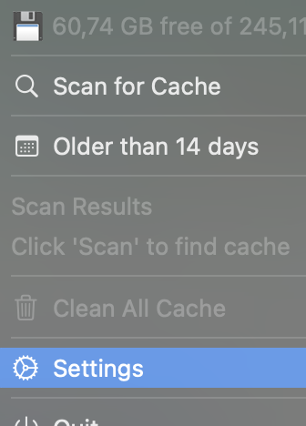

# CacheCleaner

A minimal macOS menu bar app to scan and clean cache files.


<p align="center">
  
</p>

## Features

- **Menu bar app** - Lives in your menu bar, no dock icon
- **Smart scanning** - Finds cache files across multiple locations:
  - System Caches (`~/Library/Caches`)
  - Xcode (`DerivedData`, `Archives`)
  - Node.js (`node_modules`, `npm`, `bun`, `pnpm`)
  - Next.js (`.next` build folders)
  - Docker, Homebrew, CocoaPods
  - Gradle/Maven, Python pip
  - Logs
- **Age-based filtering** - Clean files older than 7, 14, 21, 30, 60, or 90 days
- **Disk space preview** - Shows space before/after cleanup
- **Native notifications** - Get notified when scan/clean completes
- **Launch at login** - Optional auto-start

## Installation

### Download

Download the latest `.dmg` from [Releases](https://github.com/Vajbratya/CacheCleaner/releases/latest).

> **Note:** This app is not signed/notarized. macOS Gatekeeper will block it.
> To open: **Right-click → Open → Open** (or System Settings → Privacy & Security → Open Anyway)

### Build from source

```bash
git clone https://github.com/Vajbratya/CacheCleaner.git
cd CacheCleaner
swift build -c release
cp .build/release/CacheCleaner CacheCleaner.app/Contents/MacOS/
open CacheCleaner.app
```

## Usage

1. Click the ✨ icon in your menu bar
2. Select **"Older than X days"** to set the age filter
3. Click **"Scan for Cache"** to find old cache files
4. Review the breakdown by category
5. Click **"Clean All Cache"** to remove them

## How it works

CacheCleaner uses the `du` command to calculate real disk usage (handling sparse files correctly) and safely removes cache directories based on their modification date. It only deletes files older than your selected threshold.

## Contributing

PRs welcome! Please open an issue first to discuss major changes.

## License

[MIT](LICENSE)

---

Made by [Vajbratya](https://github.com/Vajbratya)
